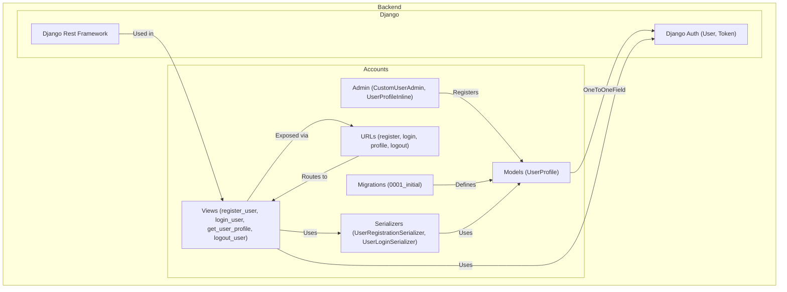

    

    <b>Automatic Architecture Diagrams from Code</b> 
    <a href="https://github.com/swark-io/swark">GitHub</a> • <a href="https://swark.io">Website</a> • <a href="mailto:contact@swark.io">Contact Us</a>

## Usage Instructions

1. **Render the Diagram**: Use the links below to open it in Mermaid Live Editor, or install the [Mermaid Support](https://marketplace.visualstudio.com/items?itemName=bierner.markdown-mermaid) extension.
2. **Recommended Model**: If available for you, use `claude-3.5-sonnet` [language model](vscode://settings/swark.languageModel). It can process more files and generates better diagrams.
3. **Iterate for Best Results**: Language models are non-deterministic. Generate the diagram multiple times and choose the best result.

## Generated Content
**Model**: GPT-4o - [Change Model](vscode://settings/swark.languageModel)  
**Mermaid Live Editor**: [View](https://mermaid.live/view#pako:eNptU01PwzAM_StRTkMq0rjugAQMJCQQaGxcKJpC43WGNpnywWf57yRxWbutOTSO_fzsPKc_vNAS-ITnqjRis2bzaa5YWNa_kONcFG-gJHl3ImdFob1ytgvFdRv4KvuUczLYaGHB3Bu9wgqOcv68i35E-IjgtLORgRKtA7P0ISljlS5RtXYJLlnLDXGlqPbkPCR-AIOiwm8wkb53ooZmqZARDrXqghmLsZtYtXMecp_JGlVgTTsbXXjrdB0zk4NI2htfqwrVwL1vsaTiSantgY3G4_HJEhW6UP0wbWGStIvZTU-sVqeM7Smzmz48w-mrUKXeu55361CEQulEmmVsrsNTOOxqBtZdGVHDhzZvXWZ0s61_uJlkkNm-l-Pj0-ZOwVyHzxVCJZvUAmHomURIaMg2_SkPA4ZSLz832oJk7yiapCgBaJoRMGuFDfnUVNtgN6aImsIqjHYPE-mIIwwALHO6ocoU7r_Drsk-wY6W_xjJUG15eMZrMLVAGX7bn5y7NdSQ8wnLuYSV8JXL-W8A-Y0UDqYoQtc1nzjjIePCO_3wpYr_s9G-XPPJSlQWfv8Aj1BREA) | [Edit](https://mermaid.live/edit#pako:eNptU01PwzAM_StRTkMq0rjugAQMJCQQaGxcKJpC43WGNpnywWf57yRxWbutOTSO_fzsPKc_vNAS-ITnqjRis2bzaa5YWNa_kONcFG-gJHl3ImdFob1ytgvFdRv4KvuUczLYaGHB3Bu9wgqOcv68i35E-IjgtLORgRKtA7P0ISljlS5RtXYJLlnLDXGlqPbkPCR-AIOiwm8wkb53ooZmqZARDrXqghmLsZtYtXMecp_JGlVgTTsbXXjrdB0zk4NI2htfqwrVwL1vsaTiSantgY3G4_HJEhW6UP0wbWGStIvZTU-sVqeM7Smzmz48w-mrUKXeu55361CEQulEmmVsrsNTOOxqBtZdGVHDhzZvXWZ0s61_uJlkkNm-l-Pj0-ZOwVyHzxVCJZvUAmHomURIaMg2_SkPA4ZSLz832oJk7yiapCgBaJoRMGuFDfnUVNtgN6aImsIqjHYPE-mIIwwALHO6ocoU7r_Drsk-wY6W_xjJUG15eMZrMLVAGX7bn5y7NdSQ8wnLuYSV8JXL-W8A-Y0UDqYoQtc1nzjjIePCO_3wpYr_s9G-XPPJSlQWfv8Aj1BREA)

